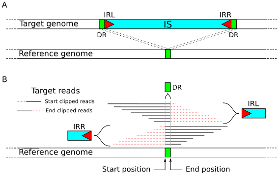

panISa
======

panISa is a software identifying insertion sequence (IS) on resequencing
data (bam file) in bacterial genomes.

Idea
----

The panISa software searches for Insertion Sequences on NGS data ab
initio (i.e. with a database-free approach) in bacterial genomes
from short read data. Briefly, the software identifies a signature
of insertion in the alignment by counting clipped reads on the start
and end positions of the potential IS. These clipped reads overlap
the direct repeats due to IS insertion. Finally, using a
reconstruction of the beginning of both sides of the IS (IRL and IRR), panISa
validates the IS by searching for inverted repeat regions.

Requirements and Installation
-----------------------------

Requirements
~~~~~~~~~~~~

The program used the python library **pysam** (>=0.9) and **request** (>=2.12)

You need to install `the emboss package <http://emboss.sourceforge.net>`_

In debian, type:

.. raw:: html

   <pre>sudo apt-get install python-pysam python-requests emboss</pre>

Installation
~~~~~~~~~~~~

Download the current tarball and unzip it.

Verify the installation using the test file

.. raw:: html

   <pre>python panISa.py test/test.bam</pre>

Alternatively, you can install from `PyPI repository <https://pypi.python.org/pypi>`_

.. raw:: html

   <pre>pip install panisa</pre>

   
Command and Options
-------------------

.. raw:: html

   <pre>python panISa.py [options] bam</pre>

Options
~~~~~~~

-h     show this help message and exit
-o     Return list of IS insertion by alignment [stdout]
-q     Minimum alignment quality value to conserve a clipped read [20]
-m     Minimum number of clipped reads to look at IS on a position [10]
-s     Maximum size of direct repeat region [20bp]
-p     Minimum percentage of same base to create consensus [0.8]
-v     show program's version number and exit

Output
------

PanISa returns result in tabular format with the following columns: 

Chromosome:
  chromosome id 
End position:
  position of the last base of the direct repeat and the left bondary of
  the potential IS (IRL)
End clipped reads:
  number of clipped reads (end position)
Direct repeat:
  nucleotidic sequence of the direct repeat
Start position:
  position of the first base of the direct repeat and the right
  bondary of the potential IS (IRR)
Start clipped reads:
  number of clipped reads (start position)
Inverted repeats:
  nucleotidic sequence of inverted repeats and their position
IS left sequence:
  reconstruction of the left boundary of the potential IS (IRL)
IS right sequence:
  reconstruction of the right boundary of the potential IS (IRR)

Validation
----------
  
PanISa results can be search for homology against ISFinder to find IS familly using the script ISFinder_search.py

.. raw:: html

   <pre>python ISFinder_search.py [options] panISa results</pre>

Recommandation
--------------

panISa works well with the alignment from **bwa** software.

Citation
--------------

If you use the panISa software, please cite the following paper:

**panISa: ab initio detection of insertion sequences in bacterial genomes from short read sequence data.** 
Treepong P, Guyeux C, Meunier A, Couchoud C, Hocquet D, Valot B. 
Bioinformatics. 2018, 34(22):3795-3800. 

doi: 10.1093/bioinformatics/bty479
